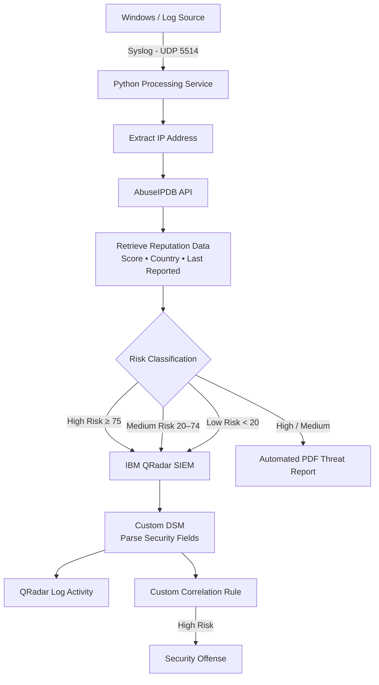

# From Reactive to Proactive
## Automating IP Threat Intelligence in SIEM Systems for Cyber Threat Detection

A cybersecurity project that automates IP threat intelligence analysis by integrating **AbuseIPDB** with **IBM QRadar SIEM** to support real-time threat detection, risk classification, and incident response.

### 🔐 Key Technologies
`IBM QRadar` `AbuseIPDB` `Python` `Syslog` `REST API` `Threat Intelligence` `SIEM` `SOC`

---

### 📄 Published Research

This project formed the foundation of my published research:

**"From Reactive to Proactive: Automating IP Threat Intelligence in SIEM Systems for Cyber Threat Detection"**

Published in the *International Journal of Electrical and Computer Engineering Systems (IJECES)*.
---

## 📌 Project Overview

Security Operations Center (SOC) analysts often need to manually investigate suspicious IP addresses using external threat intelligence platforms. This manual process can increase investigation time and introduce the possibility of human error.

This project implements an automated IP threat intelligence workflow by integrating **AbuseIPDB** with **IBM QRadar SIEM**.

The solution automatically:

- Receives suspicious IP addresses through Syslog messages.
- Extracts IP addresses using a Python-based processing service.
- Queries the AbuseIPDB API for IP reputation intelligence.
- Retrieves the abuse confidence score, country, and last reported activity.
- Classifies IP addresses into High, Medium, or Low risk levels.
- Sends enriched threat intelligence back to IBM QRadar.
- Automatically triggers a QRadar offense for High-Risk IP addresses.
- Generates analytical PDF reports for High-Risk and Medium-Risk cases to support security analysts during investigation.
---

## 🏗️ System Architecture

The solution uses an automated threat intelligence pipeline to analyze suspicious IP addresses and enrich security events before they are processed by IBM QRadar.

